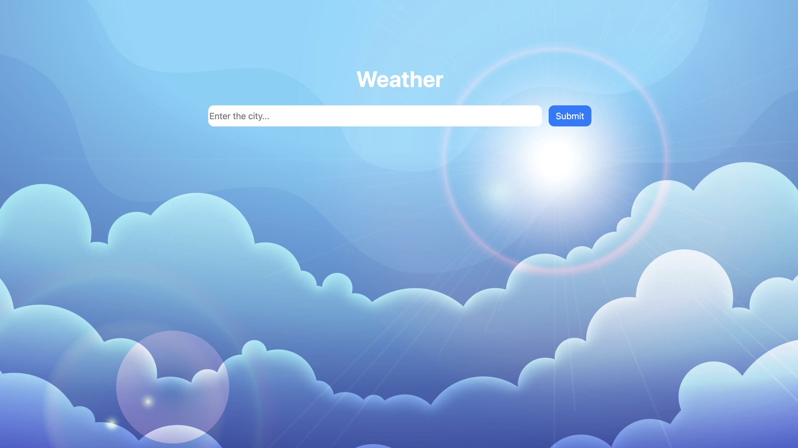

### Weather APP

- This project is a simple weather application that allows users to check the weather conditions of a city. Users can enter a city name, and the application retrieves real-time weather data using the OpenWeatherMap API. The weather information includes the city name, sky conditions, temperature, and wind speed.

- The project uses HTML, CSS (Bootstrap), and JavaScript (jQuery) to create a user-friendly interface and dynamically update the content based on the API response. Additionally, the application displays a background image corresponding to the weather conditions, providing a visually appealing experience.

